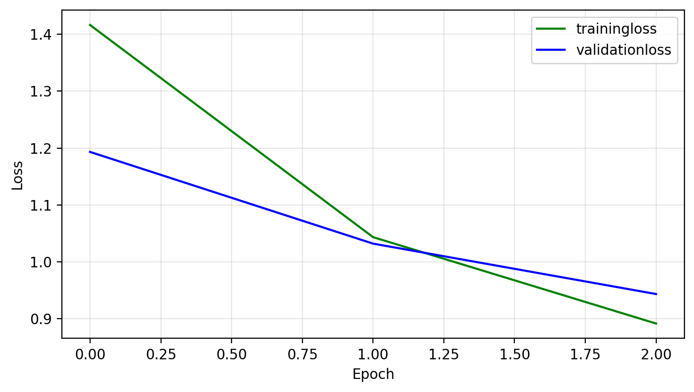

## ~XgBoost CNN~ Semantic-boost 

## Results
- CNN model accuracy on test dataset - 0.676
- XgBoost model accuracy (features extracted fro CNN after F.relu(self.fc1(x)), num_rounds=90) - 71 %
- Loss curve - CNN training on CIFAR dataset
  - 

## Todo(s)
- [ ] Test XgBoost model performance on cifar dataset (i.e no CNN model input).
- [ ] use proper metrics(log loss, precision, recall, f1, ROC curve) to check how "good" the model is on classifying the images?
- [ ] instead of custom CNN model, apply VGG/resnet architecture on dataset and then check how the xgboost model performance is on those conv features.
- [ ] apart from xgboost, try out SVM, KNN.
- [ ] include CLIP classification
- [ ] create your own custom dataset and test the meta-model on it. First start with on 3-4 classes.
- [ ] Answer the "why?" why the accuracy gets boosted after training Xgboost model on CNN features

## How to train CNN model - miniforge conda env?
```bash
source ~/.bash_profile
conda activate test
TRAINING=1 python3 -m cifar_evaluation.train_cnn
```
